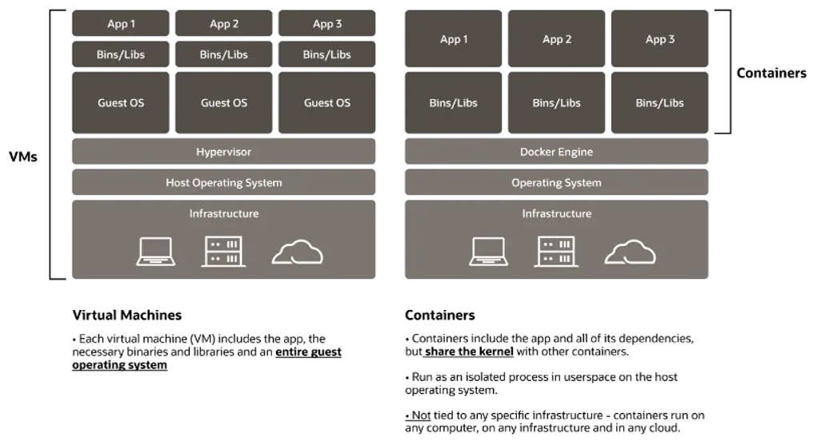
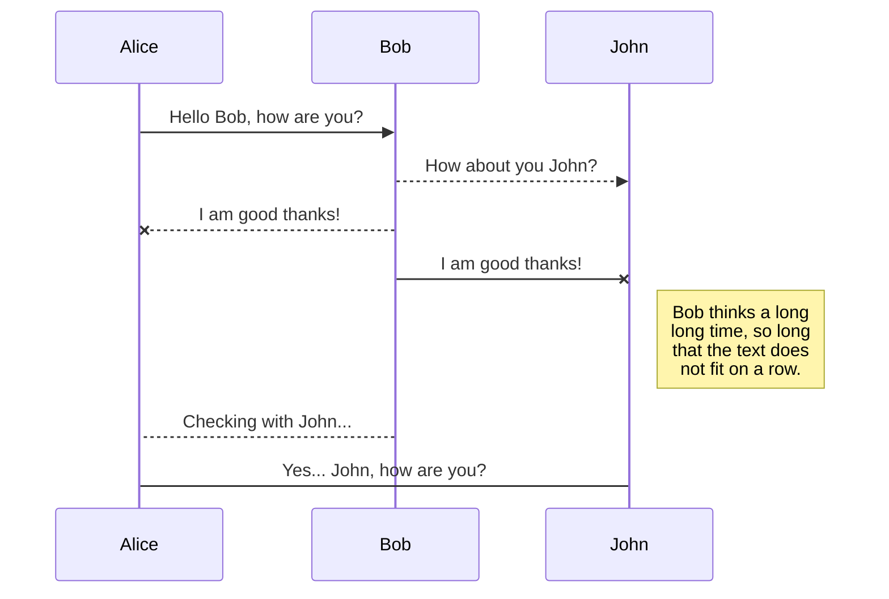
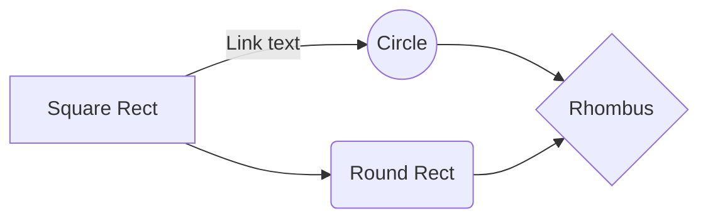

Docker Container 환경 설정하기
========================================
## 1. Docker란?
   + 컨테이너 기술을 활용하는 Application 개발, 제공 및 실행을 위해 설계된 소프트웨어 컨테이너 플랫폼입니다.   
   + Docker 컨테이너는 라이브러리, 시스템 도구, 코드, 런타임 등 애플리케이션 실행에 필요한 모든 것을 포함하고 있는 경량의 독립형 실행 컨테이너입니다.  
   + 이를 통해 Application을 빠르게 Build / Test 및 배포를 해 주는 SW Platform임.  (한 Host에 여러 개의 서비스/App실행시 Package Dependency제거)  

   

   _Docker가 사용하는 기본 Linux 커널 기능은 cgroup 및 네임스페이스입니다._ 

   |**주요개념**|**설명**|**비고**|
   |:---------:|:-----|:------:|
   |Dockerfile|Docker Image 구성을 위한 Recipe 구성파일 (명령어 조합)| -- |
   |Image|Container로 실행될 수 있는 SW 모음 (Read Only file)| -- |
   |Docker Engine|Docker Image를 Container형태로 구축/실행하기 위한 오픈소스 SW| -- |
   |Container|HW 가상화를 제공하는 VM과는 달리 사용자 공간을 추상화 하여 가상화 제공 <br> App의 독립된 실행환경 제공 목적 <br> 코드와 모든 종속성을 패키지화 하여 어플리케이션이 한 환경에서 다른 환경으로 빠르고 안정적으로 실행될 수 있게 해주는 SW장치. (Image의 Interface 개념)| -- |
   |HUB / Registry|Docker Image를 저장 및 배포하기 위한 표준방식입니다.| -- |
   |Volume|Docker Image / Container는 Read Only형태라 별도의 File을 저장하기 위해 Volume공간이 필요함. <br> Docker를 위한 Volume을 구성할 수도 있고 Host의 경로에 Mapping할 수도 있음.| -- |


## 2. Docker File 명령어
   + FROM : Docker Base Image (기반이 되는 이미지, <이미지 이름>:<태그> 형식으로 설정)  
   + MAINTAINER : 메인테이너 정보 (작성자 정보)  
   + RUN : Shell Script 또는 명령을 실행  
   + CMD : 컨테이너가 실행되었을 때 명령이 실행  
   + LABEL : 라벨 작성 (docker inspect 명령으로 label 확인할 수 있습니다.)  
   + EXPOSE : 호스트와 연결할 포트 번호를 설정한다.  
   + ENV : 환경변수 설정  
   + ADD : 파일 / 디렉터리 추가  
   + COPY : 파일 복사  
   + ENTRYPOINT : 컨테이너가 시작되었을 때 스크립트 실행  
   + VOLUME : 볼륨 마운트  
   + USER : 명령 실행할 사용자 권한 지정  
   + WORKDIR : "RUN", "CMD", "ENTRYPOINT" 명령이 실행될 작업 디렉터리  
   + ARG : Dockerfile 내부 변수  
   + ONBUILD : 다른 이미지의 Base Image로 쓰이는 경우 실행될 명령 수행  
   + SHELL : Default Shell 지정  

<br><br>

## 2. Docker 명령어
   + Container Build 하기
   ```sh
   docker build --no-cache -t ta_image:0.1 ./
   ```
   + Container Run 하기
   ```sh
   docker run -it --name cw image_name /bin/bash  
   ```
   : 중지하고 빠져 나올경우에는 exit 또는 ctrl+d, 중지없이 빠져 나올경우에는 ctrl+p, ctrl+q

```sh
docker run -itd --name cw image_name /bin/bash
docker attach image_name : container 실행시 사용
docker exec -itd image_name /bin/bash : 외부에서 컨테이너 내부 진입시....
docker start image_name : 모든 작업을 시작할때 우선 start를 해야 함.

```


'''
#docker build --no-cache -t ta_image:0.1 ./
#(run)
#docker run -it --name cw image_name /bin/bash  
#  --- 중지하고 빠져 나올경우에는 exit 또는 ctrl+d
#  --- 중지없이 빠져 나올경우에는 ctrl+p, ctrl+q

#docker run -itd --name cw image_name /bin/bash
#docker attach image_name : container 실행시 사용
#
#docker exec -itd image_name /bin/bash : 외부에서 컨테이너 내부 진입시....
#docker start image_name : 모든 작업을 시작할때 우선 start를 해야 함.

#(docker commit)
#docker commit -a "sungbin.na" -m "TAF Basic Setup" taf taf:1.1 

#(docker volume)
#1. volume 생성해서 mapping : -v 컨테이너의 볼륨 디렉터리 ---> host의 /var/lib/docker/volumes/hashvalue 형태로 볼륨 생성됨.
#  --- docker volume create myvol
#  --- docker volume ls
#  --- docker volume inspect myvol
#  --- docker run -itd -v myvol:/app --name cw image_name /bin/bash  
#2. Bind mounting : -v 를 이용해서 호스트디렉터리:컨테이너의 볼륨 디렉터리 를 매핑 - 직관적
#docker run -it -v /Users/tvswtdd/workspace:/home/workspace/ --device /dev/tty.usbserial-FT8ZXUYR --name cw taf:1.0 /bin/bash 


#공유기 - admin/admin123


#1. Ubuntu 18.04 download
FROM        ubuntu:18.04 as Base
#FROM        mongo:latest
MAINTAINER  sungbin.na@lge.com

#2. pacage update
RUN apt update
RUN apt-get update

#3. toolchain, tools install
RUN apt-get install -y build-essential
RUN apt-get install -y apt-utils
RUN apt-get install -y curl
RUN apt-get install -y wget

#4. nodejs install
RUN curl -sL https://deb.nodesource.com/setup_12.x | bash -
RUN apt-get install -y nodejs
RUN node -v && \ 
    npm -v

#5. git install
RUN apt-get install -y git

#6. Python install
RUN apt-get install -y python3.6
RUN apt-get install -y python3-dev
RUN apt-get install -y python3-setuptools
RUN apt-get install -y python3-pip

#7. 기본 작업 디렉터리 설정
WORKDIR /home
RUN mkdir workspace
WORKDIR /home/workspace

#8. 여기서 부터는 TAF 설치 하기 위해 git에서 TAF/Test Code 받아오고 기본적인 셋업 하는 부분임.
#이 부분은 wall에서 ssh로 자동 인증받아 git pull 하기 위해 필요한 부분인데 수동으로 해 주는게 보안측면에서 좋음.
#File Copy : local --> docker image
#ssh-keygen -t rsa 을 한 다음에 /root/.ssh/id_rsa.pub 파을을 cat 해서 wall.lge.com에 login해서 개인 설정에 붙여 넣기 함.
# SSH 서버에 public key 전송하기 : scp $HOME/.ssh/id_rsa.pub {userid}@{ip address}:id_rsa.pub
# SSH 서버의 authorized_keys에 public key 등록하기 : cat $HOME/id_rsa.pub >> $HOME/.ssh/authorized_keys


#9. TAF Clonegotj prerequisites.sh 실행해서 셋업함. 이 부분도 직접 해주는게 편함.
# workspace 폴더로 가서 git clone한다.
# git clone ssh://sungbin.na@wall.lge.com:29448/webos-pro/automation-tests
# cd automation-test
# git checkout @49.webos4tv
# ./prerequisites.sh
#여기까지 docker image 생성해서 base 이미지로 사용하면 됨.
#--------------------------------
#(docker run with common file folder/volume)
# docker run -it --name cw image_name /bin/bash 
# docker run -it -v /Users/tvswtdd/workspace:/home/workspace --name cw taf:1.3 /bin/bash  
# docker run -it --rm -v /Users/tvswtdd/workspace:/home/workspace --name cw taf:1.5 /bin/bash  

# docker run -it -v /Users/tvswtdd/workspace:/home/workspace --device /dev/tty.usbserial-FT8ZXUYR --name cw taf:1.3 /bin/bash  (동작안함)
# docker run -it -v /Users/tvswtdd/workspace:/home/workspace --privileged -v /dev:/dev --name cw taf:1.2 /bin/bash  (동작안함)
# docker run -it -v /Users/tvswtdd/workspace:/home/workspace --privileged -v /dev/tty.usbserial-FT8ZXUYR:/dev/tty.usbserial-FT8ZXUYR --name cw taf:1.2 /bin/bash  (ok)
#test script 실행
#List File 실행 : ./qa-test-runner.py -i 192.168.0.41 -l ./lists/production/P2-InputSwitch.list
#단위 Script실행 : ./qa-test-runner.py -i 192.168.0.18 ./p2/APP/SettingsApiUpdate.py


# serial cable terminal 연결방법
# screen /dev/tty.usbserial-FT8ZXUYR 115200
# ssh -v -oHostKeyAlgorithms=+ssh-rsa root@192.168.0.18 (tv ip)


# MAC 관련 Docker 환경 : https://defian.tistory.com/entry/Docker-MAC-%EA%B4%80%EB%A0%A8-Docker-%ED%99%98%EA%B2%BD
** 왜 안되지 **


# Dillinger
## _The Last Markdown Editor, Ever_

[](https://nodesource.com/products/nsolid)

[](https://travis-ci.org/joemccann/dillinger)

Dillinger is a cloud-enabled, mobile-ready, offline-storage compatible,
AngularJS-powered HTML5 Markdown editor.

- Type some Markdown on the left
- See HTML in the right
- ✨Magic ✨
## 😍
## Features

- Import a HTML file and watch it magically convert to Markdown
- Drag and drop images (requires your Dropbox account be linked)
- Import and save files from GitHub, Dropbox, Google Drive and One Drive
- Drag and drop markdown and HTML files into Dillinger
- Export documents as Markdown, HTML and PDF

Markdown is a lightweight markup language based on the formatting conventions
that people naturally use in email.
As [John Gruber] writes on the [Markdown site][df1]

> The overriding design goal for Markdown's
> formatting syntax is to make it as readable
> as possible. The idea is that a
> Markdown-formatted document should be
> publishable as-is, as plain text, without
> looking like it's been marked up with tags
> or formatting instructions.

This text you see here is *actually- written in Markdown! To get a feel
for Markdown's syntax, type some text into the left window and
watch the results in the right.

## Tech

Dillinger uses a number of open source projects to work properly:

- [AngularJS] - HTML enhanced for web apps!
- [Ace Editor] - awesome web-based text editor
- [markdown-it] - Markdown parser done right. Fast and easy to extend.
- [Twitter Bootstrap] - great UI boilerplate for modern web apps
- [node.js] - evented I/O for the backend
- [Express] - fast node.js network app framework [@tjholowaychuk]
- [Gulp] - the streaming build system
- [Breakdance](https://breakdance.github.io/breakdance/) - HTML
to Markdown converter
- [jQuery] - duh

And of course Dillinger itself is open source with a [public repository][dill]
 on GitHub.

## Installation

Dillinger requires [Node.js](https://nodejs.org/) v10+ to run.

Install the dependencies and devDependencies and start the server.

```sh
cd dillinger
npm i
node app
```

For production environments...

```sh
npm install --production
NODE_ENV=production node app
```

## Plugins

Dillinger is currently extended with the following plugins.
Instructions on how to use them in your own application are linked below.

| Plugin | README |
| ------ | ------ |
| Dropbox | [plugins/dropbox/README.md][PlDb] |
| GitHub | [plugins/github/README.md][PlGh] |
| Google Drive | [plugins/googledrive/README.md][PlGd] |
| OneDrive | [plugins/onedrive/README.md][PlOd] |
| Medium | [plugins/medium/README.md][PlMe] |
| Google Analytics | [plugins/googleanalytics/README.md][PlGa] |

## Development

Want to contribute? Great!

Dillinger uses Gulp + Webpack for fast developing.
Make a change in your file and instantaneously see your updates!

Open your favorite Terminal and run these commands.

First Tab:

```sh
node app
```

Second Tab:

```sh
gulp watch
```

(optional) Third:

```sh
karma test
```

#### Building for source

For production release:

```sh
gulp build --prod
```

Generating pre-built zip archives for distribution:

```sh
gulp build dist --prod
```

## Docker

Dillinger is very easy to install and deploy in a Docker container.

By default, the Docker will expose port 8080, so change this within the
Dockerfile if necessary. When ready, simply use the Dockerfile to
build the image.

```sh
cd dillinger
docker build -t <youruser>/dillinger:${package.json.version} .
```

This will create the dillinger image and pull in the necessary dependencies.
Be sure to swap out `${package.json.version}` with the actual
version of Dillinger.

Once done, run the Docker image and map the port to whatever you wish on
your host. In this example, we simply map port 8000 of the host to
port 8080 of the Docker (or whatever port was exposed in the Dockerfile):

```sh
docker run -d -p 8000:8080 --restart=always --cap-add=SYS_ADMIN --name=dillinger <youruser>/dillinger:${package.json.version}
```

> Note: `--capt-add=SYS-ADMIN` is required for PDF rendering.

Verify the deployment by navigating to your server address in
your preferred browser.

```sh
127.0.0.1:8000
```
## UML diagrams

You can render UML diagrams using [Mermaid](https://mermaidjs.github.io/). For example, this will produce a sequence diagram:



And this will produce a flow chart:


## License

MIT

**Free Software, Hell Yeah!**

[//]: # (These are reference links used in the body of this note and get stripped out when the markdown processor does its job. There is no need to format nicely because it shouldn't be seen. Thanks SO - http://stackoverflow.com/questions/4823468/store-comments-in-markdown-syntax)

   [dill]: <https://github.com/joemccann/dillinger>
   [git-repo-url]: <https://github.com/joemccann/dillinger.git>
   [john gruber]: <http://daringfireball.net>
   [df1]: <http://daringfireball.net/projects/markdown/>
   [markdown-it]: <https://github.com/markdown-it/markdown-it>
   [Ace Editor]: <http://ace.ajax.org>
   [node.js]: <http://nodejs.org>
   [Twitter Bootstrap]: <http://twitter.github.com/bootstrap/>
   [jQuery]: <http://jquery.com>
   [@tjholowaychuk]: <http://twitter.com/tjholowaychuk>
   [express]: <http://expressjs.com>
   [AngularJS]: <http://angularjs.org>
   [Gulp]: <http://gulpjs.com>

   [PlDb]: <https://github.com/joemccann/dillinger/tree/master/plugins/dropbox/README.md>
   [PlGh]: <https://github.com/joemccann/dillinger/tree/master/plugins/github/README.md>
   [PlGd]: <https://github.com/joemccann/dillinger/tree/master/plugins/googledrive/README.md>
   [PlOd]: <https://github.com/joemccann/dillinger/tree/master/plugins/onedrive/README.md>
   [PlMe]: <https://github.com/joemccann/dillinger/tree/master/plugins/medium/README.md>
   [PlGa]: <https://github.com/RahulHP/dillinger/blob/master/plugins/googleanalytics/README.md>
