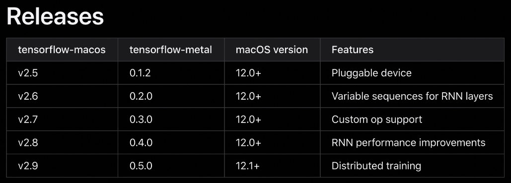

실리콘(M1, M2) 맥(Mac) OS 에서 텐서플로(TensorFlow) 설치 방법
=====================================================

## STEP 1) Xcode 개발자 도구 설치
```sh  
xcode-select --install  
```


## STEP 2) miniconda 최신버전 다운로드  
[minicona 다운로드](https://repo.anaconda.com/miniconda/Miniconda3-latest-MacOSX-arm64.sh)


## STEP 3) miniconda 설치  
```sh
bash ./Miniconda3-latest-MacOSX-arm64.sh -b -p $HOME/miniconda
```
설치가 정상적으로 완료가 되었다면 아래의 명령어를 실행하여 다음과 같이 출력되는지 확인 - (base)가 표시된다.
   ```sh
   source ~/miniconda/bin/activate
   ```
출력 결과가 아래와 같이 (base)가 표시되면 정상임.  


### STEP 4) miniconda의 PATH 추가
~/.zshrc 파일 맨 아래 경로 추가 / 저장 / 재실행 (source ~/.zshrc) 후 conda를 쳐서 실행된는지 확인한다.
```sh
export PATH="$HOME/miniconda/bin:$PATH"
```

### STEP 5) 가상환경 설치 및 tensorflow 설치   
1. 터미널에 다음의 명령어를 입력하여 가상환경을 설치 합니다.
   ```sh
   conda create -n MachineLearning python=3.8
   ```  
   (실행결과)
     

2. 생성된 가상환경으로 전환한다.  
   ```sh
   conda activate MachineLearning
   ```

3. 가상환경에 tensorflow 설치 코드 (2.9.0 버전 설치)
   ```
   conda install -c apple tensorflow-deps
   pip install tensorflow-macos==2.9.0
   pip install tensorflow-metal==0.5.0
   ```  
     

4. pythohn 실행 후 아래와 같이 실행한다.  
   

5. 가상환경을 종료하고 default로 전환한다.  
   ```sh
   conda deactivate
   ```


<br><br>
**(참고자료)**
---
1. **[참조링크] - M1/M2 기반 Mac Book에 tensorflow 설치 방법**  
2. [M1/M2 기반 Mac Book에 tensorflow 설치 방법](https://teddylee777.github.io/tensorflow/tensorflow-silicon-install/#step-3-miniconda-%EC%84%A4%EC%B9%98)


[참조링크]:<https://teddylee777.github.io/tensorflow/tensorflow-silicon-install/#step-3-miniconda-%EC%84%A4%EC%B9%98>   

---

## UML diagrams

You can render UML diagrams using [Mermaid](https://mermaidjs.github.io/). For example, this will produce a sequence diagram:


And this will produce a flow chart:


[//]: # (These are reference links used in the body of this note and get stripped out when the markdown processor does its job. There is no need to format nicely because it shouldn't be seen. Thanks SO - http://stackoverflow.com/questions/4823468/store-comments-in-markdown-syntax)

   [dill]: <https://github.com/joemccann/dillinger>
   [git-repo-url]: <https://github.com/joemccann/dillinger.git>
   [john gruber]: <http://daringfireball.net>
   [df1]: <http://daringfireball.net/projects/markdown/>
   [markdown-it]: <https://github.com/markdown-it/markdown-it>
   [Ace Editor]: <http://ace.ajax.org>
   [node.js]: <http://nodejs.org>
   [Twitter Bootstrap]: <http://twitter.github.com/bootstrap/>
   [jQuery]: <http://jquery.com>
   [@tjholowaychuk]: <http://twitter.com/tjholowaychuk>
   [express]: <http://expressjs.com>
   [AngularJS]: <http://angularjs.org>
   [Gulp]: <http://gulpjs.com>

   [PlDb]: <https://github.com/joemccann/dillinger/tree/master/plugins/dropbox/README.md>
   [PlGh]: <https://github.com/joemccann/dillinger/tree/master/plugins/github/README.md>
   [PlGd]: <https://github.com/joemccann/dillinger/tree/master/plugins/googledrive/README.md>
   [PlOd]: <https://github.com/joemccann/dillinger/tree/master/plugins/onedrive/README.md>
   [PlMe]: <https://github.com/joemccann/dillinger/tree/master/plugins/medium/README.md>
   [PlGa]: <https://github.com/RahulHP/dillinger/blob/master/plugins/googleanalytics/README.md>


