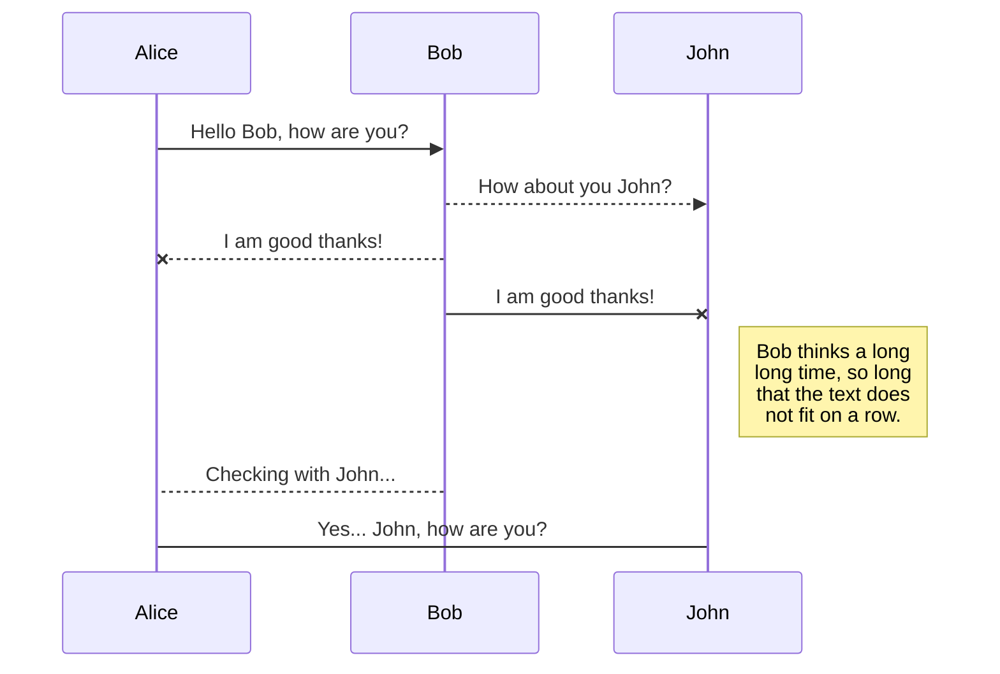
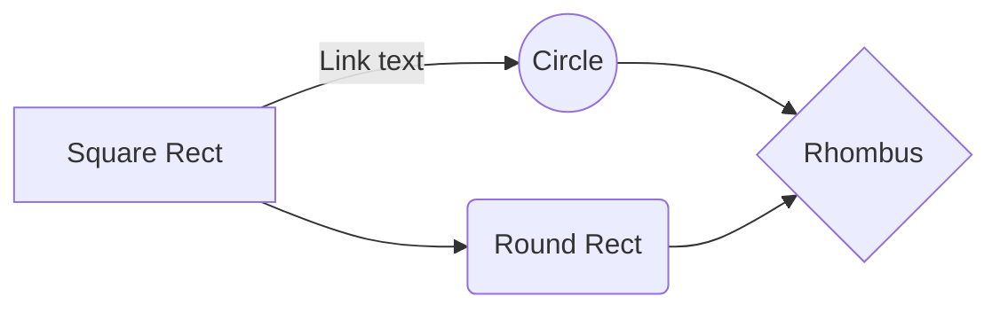

Mac Book 에서 Machine Learning 환경 설정하기
========================================
(React에서 Bootstrap 사용하기)

npm install react-bootstrap bootstrap
import 'bootstrap/dist/css/bootstrap.min.css';

<h1>참고로 알아두면 좋은 페이지</h1>
<p>부트스트랩 내 Examples를 보셔도 좋습니다.</p>
<p>무료 테마 : https://startbootstrap.com/</p>
<p>테마 구매 : https://themes.getbootstrap.com/</p>
<p>테마 구매 : https://wrapbootstrap.com/</p>
<p>테마 구매 : https://themeforest.net/search/bootstrap</p>
<p>서버유지 : https://www.iwinv.kr/</p>
<p>텍스트 에디터 : https://summernote.org/, 
                    https://ui.toast.com/tui-editor</p>
<p>경고창 : https://sweetalert2.github.io/</p>

(Project 생성)
git clone http://mod.lge.com/hub/tdd/heytas.git

yarn create react-app prjname
npm init react-app prjname
creat-react-app prjname

(component 선언방식)
함수형 컴포넌트 : 주로 많이 사용 + hook : function App { }
 - 메모리를 적게 먹고 빠름, state와 lifecycle API사용 불가하다는 단점이 있음. - Hook을 이용해서 해결 가능. (권장사항)
클래스형 컴포넌트 :  class App extends component {}
 - 클래스 컴포넌트와 함수형 컴포넌트의 차이점은 클래스형 컴포넌트의 경우 state 기능 및 lifecycle기능을 사용할 수 있음. 임의 메서드를 정의할 수 있음.

(모듈 삽입)
nodejs 는 require
enact 는 import 

(Bundler)
webpack, parcel, browserify --> webpack loader를 통해 불러와 사용가능

(바벨)
최신 javascripts로 작성된 코드를 ES5형태의 코드로 변환 - 구형 브라우져와의 호환때문에....
ES5 이후 ECMAScript 2015(ES6) ECMAScript 2016(ES7)


(JSX)
javascripts 확장문법 - html과 유사
쉽게 UI를 rendering가능
JSX 내부에서 javascripts를 사용하려면 {}로 감싸면 됨. {name}
주석 처리는 {/*  */}
HTML에서는 class를 사용 -- JSX는 className 을 사용해야 함.

(함수형 component)
function 형태로 component를 만들어 사용


(Fragment)
component 는 반드시 부모 요소로 감싸져야 함. 보통 <div></div>를 많이 쓰나 { Fragment } 를 import 해서 <Fragement></Fragement>를 사용해도 됨.
<></> 처럼 표시도 가능함.

(변수)
const a; //상수를 저장, scope는 { } 단위임.
let a; // read/write, scope는 { } 단위임.
var a; // ES6 이전에 사용하던 방식 - var 는 scope가 function 단위임.


(비교연산)
=== 같음

(논리연산)
&& , ||, 

(ES6의 Arrow 함수)
function App {} -----  () => {} 로 변경 가능.  arrow 함수는 this가 인스턴스를 가리킴. 객체 내부의 this와 화살표 함수 내부의 this 가 가리키는 것은 서로 다름 (객체/인스턴스)

(props)
properties의 줄임말...
property를 생성해서 component로 값을 넘길 수 있다. - props.js 예제 참고
const App = (props) => { return (<div> {props.name} </div>); }
비구조화 할당 - component에서 매번 props을 쓰지 않도록 객체에서 값을 호출하는 방식
const App = (props) => {
    const { name, age } = props;
     return (<div> {name} </div>); }
}

const App = (name, age) => {
     return (<div> {name} </div>); }
}

class App extends Component {
    render() {
        const { name, age } = this.props
        return { <div> {name} 이고 나이는 {age} 입니다. </div> }
    }
}

(PropTypes) - props 의 type (string, ...)을 지정하고자 할때
MyComponent.propTypes = {
    name : PropTypes.string
    age : PropTypes.number.isRequired  // isRequired를 통한 검증
}

props의 default 값, PropTypes 지정은 class 밖에 또는 안에 할 수 있다.


(주요 키워드)
1. component 종류 : class형 component, 함수형 component
2. props : 개념, 비구조화 할당, 초기값설정, type 설정, 필수항목 설정
3. state 
 - class component에서 state : constructor에서 초기화, constructor없이 초기화 사용방법, 비동기 동작
 - funcion component에서 useState : 16.8부터 사용가능
 - callback
 - state 사용시 주의사항 : spread 연산자 (...)
4. event 
 - e 객체 : SyntheticEvent로 web browser의 native event를 감싸는 객체
           SyntheticEvent는 event가 종료되면 초기화 되므로 추후 참조할 일이 있으면 e.persist()를 호출해 줘야 함.
 - 별도의 event handler 정의하여 사용하기 (가독성 높이기 위해)           

 5. ref 
  - class형 component에서 ref 사용하고 
    함수형 component에서 ref 사용하려면 Hooks을 사용해야 함. 
  - 특정 input에 포커스 주기, 스크롤 박스 조작, canvas에 그림 그릴때 DOM접근을 위해 ref를 사용함.
  1) callback를 통한 ref 설정 : <input ref = { (ref) => { this.input=ref }} />
  2) createRef를 통한 ref 설정 : input = React.createRef(); <input ref = {this.input} />
     사용시에는 this.input.current 를 조회하면 됨. callback함수와 다르게 .current 넣어주어야 함.
  3) 자신이 만든 component에 ref 달기
    - 이렇게 되면 부모에서 컴포넌트 내부의 ref 에도 접근이 가능함.
    - state로 특정 component id지정효과 낼 수도 있지만 ref를 이용해서 가능함.
  4) MyComponent에 ref 달기
     <MyComponent ref={(ref) => {this.myComponent = ref}} 을 하면 myComponent.input  myComponent.handleClick 등 접근가능

6. map (반복되는 compoenent rendering 할때 사용)
 - map / key를 이용해서 iteration을 통해 반복되는 item을 rendering한다.

7. Component의 lifecycle (page 188 그림)
 - lifecycle Method는 총 9가지입니다. Will - 사전, Did - 사후 실행되는 메소드.
 - lifecycle Method는 3가지 카테고리로 나뉨 - Mount, Update, Unmount
  1) Mount : DOM이 생성되고 web browser 상에 나타남 - 페이지에 component가 나타남
    - constructor -> getDrievedStateFromProps -> render -> compoenentDidMount (component를 web browser상에 나타난 후 호출되는 메소드)
  2) Update : component 정보를 업데이트 (page 174 그림 참조)
    - props or state가 바뀔때
    - 부모 component가 rerendering 될때
    - this.forceUpdate로 강제로 렌더링을 트리거 할때
  3) Unmount : 페이지에 component가 사라짐 (page 175)
    - Mount의 반대과정, 즉 component를 DOM에서 제거하는 것을 말함.
    - componentWillUnmount : compoenent가 웹 브라우저상에서 사라지기 전에 호출하는 메서드.

 - lifecycle method 살펴보기
  1) render() 
   - method안에서 this.props, this.state 접근 가능, react요소 반영함.
   - 해당 메소드안에서는 event 설정이 아닌 곳에서 setState를 사용하면 안됨. DOM에 접근해서도 안됨.
     : DOM 정보를 가져오거나 state에 변화를 줄 때에는 compoenentDidMount에서 처리해야 함.

  2) constructor(props) {}
   - 초기 state 설정
  
  3) getDrievedStateFromProps
   - props로 받아온 값을 state에 동기화 시키는 용도, component가 mount/업데이트 될때 호출됨.

  4) componentDidMount()
   - component를 만들고 첫 렌더링을 다 마친후 실행됨. 
   - 다른 자바스크립트 라이브러리 / 프레임워크 함수 호출, event등록, setTimeout, setInterval, 네트워크 요청과 같은 비동기 처리작업.

  5) shouldComponentUpdate()
   - props or state를 변경했을때 리렌더링을 시작할지 여부를 결정하는 메서드.
   - 현재의 props or sate 는 this.props, this.state로 접근하고 새로 설정될 props, state는
     nextProps, nextState로 접근함.

  6) getSnapshotBeforeUpdate()
   - render에서 만들어진 결과물이 브라우저에 실제로 반영되기 직전에 호출됨.
   - 이 메서드의 반환값은 compoenentDidMount의 3번째 파라미터로 사용됨. 
     (주로 업데이트 직전에 참고해야 할 정보 - 스크롤바 위치 등등)

  7) componentDidUpdate()
   - getSnapshotBeforeUpdate()에서 반환값이 있다면 여기서 3번째 파라미터 snapshot값을 전달받음.
   - 렌더링 완료 후 실행됨. prevProps, prevState 를 사용하여 이전 컴포넌트가 가졌던 데이터에 접근가능.

  8) componentWillUnmount()
   - component를 제거할때 실행됨. 
   - componentDidMount 에서 등록한 이벤트, 타이머, 직접 생성한 DOM이 있다면 여기서 제거해야 함.

  9) componentDidCatch()
   - component 렌더링 도중에 에러가 발생했을때 어플리케이션이 먹통이 되지 않고 오류 UI를 보여주는 기능.
   - component 자신에게 발생하는 에러는 잡아내지 못하고 자신의 this.props.children 으로 전달되는 컴포넌트에서 
     발생하는 에러만 잡아낼 수 있음.
   - Error를 잡아주는 ErrorBoundary 컴포넌트 사용


(Hooks)
1. useState() : 상태관리
2. useEffect() : Class형 component에서의 componentDidMount + componentDidUpdate 합친형태
  - 특정 값이 바뀌었을때 useEffect() 호출하는 방법 , 두번째 파라미터에 [모니터링 변수, ...] 활용
  - component 마운트 되었을때 한번만 동작하도록 하는 방법, 두번째 파라미터에 [] 
  - cleanup(뒷정리하기) : component가 unmount되거나 업데이트되기 직전에 어떠한 작업을 수행하고 싶다면
    return 함수를 통해 cleanup 함수를 반환해 줘야 함.
3. useReducer()
  - useState보다 더 다양한 컴포넌트 상황에 따라 다양한 상태를 다른 값으로 업데이트 해 주고 싶을때 사용하는 Hook 입니다.
  - reducer 첫번째 파라미터는 reducer function (바같으로 빼고자 하는 로직), 두번째 파라미터는 리듀서의 기본값
  - component 내부의 업데이트 로직을 컴포넌트 바같으로 빼 낼 수 있다는 장범이 있음.
  - e.target을 활용해서 간단히 작성하기
4. useMemo()
  - 렌더링 하는 과정에서 특정값이 바뀌었을때만 연산을 실행하고, 원하는 값이 바뀌지 않았으면 이전에 연산했던 결과를 재 사용 하는 방식
  - useMemo()의 두번째 파라미터 []에 변경되었을때만 호출되도록 하는 값을 넣어주면 됨.
5. useCallback()
  - useMemo()와 유사함.
  - event handler가 매번 component가 rendering 될때 호출되면 비 효율적임
  - 따라서 처음 component가 생성될때 또는 값이 바뀌었을때 효율적으로 생성/호출되도록 하기 위함.
6. useRef
  - 특정 컴포넌트를 가리킬때 사용 : 포커싱, 컨트롤등
  - 컴포넌트이 로컬 변수로 사용할때 useRef 사용 - 값이 바뀌어도 렌더링 안됨.
7. useContext
8. 사용자 정의 hook
  - usePromise (p386)

(css styling)
1. styling 실습
 - 일반 css 
 - Sass (Syntactically Awesome Style Sheets) 사용하기 - CSS의 전처리기 중의 하나임. 확장자는 .scss, .sass 
 - CSS Module 사용하기
 - styled-component 사용하기

2. css class 이름 작명 : 컴포넌트 이름-클래스형태 - App-header  App-logo  App-link등등
3. CSS Selector
 .App 안에 들어있는 테그/클래스를 지정해서 스타일을 적용하고 싶다면 
 - .App .logo { } 
 - .App header { }

4. node-sass lib설치하면 Sass 를 CSS로 변환함. : yarn add node-sass

5. CSS Module
 - CSS를 불러와서 [파일이름]_[클래스이름]_[해시값] 형태로 자동으로 만들어서 컴포넌트 스타일 클래스 이름이 중첩되지 않도록 해 주는 기술임.
 - .module.css 확장자로 저장하기만 하면 CSS Module이 적용이 됨.
 - global CSS를 사용하려면 :global .something {} 으로 선언함.
 - classnames 
   1) CSS 클래스를 조건부로 설정할때 유용한 라이브러리입니다. (yarn add classnames)
   2) bind를 이용해서 다중 css 설정하는데 사용

6. styled-components
 - 스타일링의 새로운 패러다임 : 자바스크립트 파일안에 스타일을 선언하는 방식
 - CSS in JS 라고 부르며 이러한 라이브러리가 많은데 대표적인게 styled-components 또는 emotion이 대표적임.
 - .css  .scss확장자를 별도로 만들지 않아도 되는 장점이 있음.

 


yarn add node-sass classnames react-icons
https://react-icons.github.io/react-icons


(성능향상)
Component rerendering 발생하는 조건
- 자신의 전달받은 props값이 변경될때
- 자신의 state가 바뀔때
- 부모의 컴포넌트가 리런더링 될때
- forceUpdate 함수가 실행될때

1. 성능향상을 위해 memo를 사용함. 컴포넌트의 props가 변경되지 않았다면 리렌더링 하지 않도록 최적화 실시
   class형 component 에서는 shouldComponentUpdate라는 라이프사이클을 사용하면 됨.
   export default React.memo(TodoListItem);
   //export default TodoListItem;
2.todos 배열이 바뀌면 onRemove와 onToggle함수가 새롭게 바뀜 - 최신의 todos를 참조하기 때문에
  todos배열이 바뀔때 마다 함수가 새로 만들어짐.
  1) useState의 함수형 업데이트 기능 사용
     setTodos를 사용할때 그 안에 todos => 만 넣어주면 됨 (p298)
  2) useReducer 사용 (p300)
3. 리스트 컴포넌트 작성시에는 리스트와 리스트 아이템을 동시에 최적화 해 줘야 함. (React.memo)

4. react-virtualized 사용한 렌더링 최적화
2500개의 항목을 모두 렌더링 하는게 아니라 화면에 보이는 부분을 먼저 렌더링 하고 보이지 않는 부분은 react-virtualized
기능으로 렌더링 하지 않고 크기만 차지하게끔 할 수 있다.
자원을 효율적으로 사용 가능함.
<List />
yarn add react-virtualized


(불션성의 중요성)
기존의 값을 직접 수정하지 않으면서 새로운 값을 만들어 내는 것을 불변성을 지킨다.
const array = [1, 2, 3]
const next_array = arry  --> array 와  next_array는 같은 값을 가짐. (약은 복사)
const next_array = [...array] --> array와 next_array는 다른 값을 가짐. (깊은 복사)
object도 동일함.

...을 통해 새로운 객체를 만들기 때문에 React.memo를 사용해서 props이 바뀌었는지 알아내서 렌더링 최적화.
객체 구조가 복잡해 질 경우 immer라는 라이브러리로 편하게 작업 가능함.

yarn create react-app immer-tutorial
cd immer-tuturial
yarn add immer


(SPA - router 사용하기)
https://velog.io/@velopert/react-router-v6-tutorial
yarn add react-router-dom 
1. import { BrowserRouter } from 'react-router-dom';
   src/index.js 에 <BrowserRouter> <App /> </BrowserRouter>
2. import { BrowserRouter as Router, Route, Routes, Link } from "react-router-dom";
3. 하나의 페이지에 여러개 경로 설정 : <Route path={("/about", "/info")} element={<About />} />
4. 서브 Route
5. 기타 부가기능 : NavLink, Switch, withRouter, history
아마도 부가기능은 react-router-dom 6.0 이상부터는 없어진것 같음....


(production build 방법)
yarn build
yarn global add serve
serve -s build


https://newsapi.org/

14장. 외부 api를 연동하여 뉴스 뷰어 만들기
1. callback 함수 - callback 지욕 -> promise
2. api 호출 및 데이터 받아오기 : http client - axios (Promise기반 데이터 처리) : yarn add axios

** 왜 안되지 **


# Dillinger
## _The Last Markdown Editor, Ever_

[](https://nodesource.com/products/nsolid)

[](https://travis-ci.org/joemccann/dillinger)

Dillinger is a cloud-enabled, mobile-ready, offline-storage compatible,
AngularJS-powered HTML5 Markdown editor.

- Type some Markdown on the left
- See HTML in the right
- ✨Magic ✨
## 😍
## Features

- Import a HTML file and watch it magically convert to Markdown
- Drag and drop images (requires your Dropbox account be linked)
- Import and save files from GitHub, Dropbox, Google Drive and One Drive
- Drag and drop markdown and HTML files into Dillinger
- Export documents as Markdown, HTML and PDF

Markdown is a lightweight markup language based on the formatting conventions
that people naturally use in email.
As [John Gruber] writes on the [Markdown site][df1]

> The overriding design goal for Markdown's
> formatting syntax is to make it as readable
> as possible. The idea is that a
> Markdown-formatted document should be
> publishable as-is, as plain text, without
> looking like it's been marked up with tags
> or formatting instructions.

This text you see here is *actually- written in Markdown! To get a feel
for Markdown's syntax, type some text into the left window and
watch the results in the right.

## Tech

Dillinger uses a number of open source projects to work properly:

- [AngularJS] - HTML enhanced for web apps!
- [Ace Editor] - awesome web-based text editor
- [markdown-it] - Markdown parser done right. Fast and easy to extend.
- [Twitter Bootstrap] - great UI boilerplate for modern web apps
- [node.js] - evented I/O for the backend
- [Express] - fast node.js network app framework [@tjholowaychuk]
- [Gulp] - the streaming build system
- [Breakdance](https://breakdance.github.io/breakdance/) - HTML
to Markdown converter
- [jQuery] - duh

And of course Dillinger itself is open source with a [public repository][dill]
 on GitHub.

## Installation

Dillinger requires [Node.js](https://nodejs.org/) v10+ to run.

Install the dependencies and devDependencies and start the server.

```sh
cd dillinger
npm i
node app
```

For production environments...

```sh
npm install --production
NODE_ENV=production node app
```

## Plugins

Dillinger is currently extended with the following plugins.
Instructions on how to use them in your own application are linked below.

| Plugin | README |
| ------ | ------ |
| Dropbox | [plugins/dropbox/README.md][PlDb] |
| GitHub | [plugins/github/README.md][PlGh] |
| Google Drive | [plugins/googledrive/README.md][PlGd] |
| OneDrive | [plugins/onedrive/README.md][PlOd] |
| Medium | [plugins/medium/README.md][PlMe] |
| Google Analytics | [plugins/googleanalytics/README.md][PlGa] |

## Development

Want to contribute? Great!

Dillinger uses Gulp + Webpack for fast developing.
Make a change in your file and instantaneously see your updates!

Open your favorite Terminal and run these commands.

First Tab:

```sh
node app
```

Second Tab:

```sh
gulp watch
```

(optional) Third:

```sh
karma test
```

#### Building for source

For production release:

```sh
gulp build --prod
```

Generating pre-built zip archives for distribution:

```sh
gulp build dist --prod
```

## Docker

Dillinger is very easy to install and deploy in a Docker container.

By default, the Docker will expose port 8080, so change this within the
Dockerfile if necessary. When ready, simply use the Dockerfile to
build the image.

```sh
cd dillinger
docker build -t <youruser>/dillinger:${package.json.version} .
```

This will create the dillinger image and pull in the necessary dependencies.
Be sure to swap out `${package.json.version}` with the actual
version of Dillinger.

Once done, run the Docker image and map the port to whatever you wish on
your host. In this example, we simply map port 8000 of the host to
port 8080 of the Docker (or whatever port was exposed in the Dockerfile):

```sh
docker run -d -p 8000:8080 --restart=always --cap-add=SYS_ADMIN --name=dillinger <youruser>/dillinger:${package.json.version}
```

> Note: `--capt-add=SYS-ADMIN` is required for PDF rendering.

Verify the deployment by navigating to your server address in
your preferred browser.

```sh
127.0.0.1:8000
```
## UML diagrams

You can render UML diagrams using [Mermaid](https://mermaidjs.github.io/). For example, this will produce a sequence diagram:



And this will produce a flow chart:


## License

MIT

**Free Software, Hell Yeah!**

[//]: # (These are reference links used in the body of this note and get stripped out when the markdown processor does its job. There is no need to format nicely because it shouldn't be seen. Thanks SO - http://stackoverflow.com/questions/4823468/store-comments-in-markdown-syntax)

   [dill]: <https://github.com/joemccann/dillinger>
   [git-repo-url]: <https://github.com/joemccann/dillinger.git>
   [john gruber]: <http://daringfireball.net>
   [df1]: <http://daringfireball.net/projects/markdown/>
   [markdown-it]: <https://github.com/markdown-it/markdown-it>
   [Ace Editor]: <http://ace.ajax.org>
   [node.js]: <http://nodejs.org>
   [Twitter Bootstrap]: <http://twitter.github.com/bootstrap/>
   [jQuery]: <http://jquery.com>
   [@tjholowaychuk]: <http://twitter.com/tjholowaychuk>
   [express]: <http://expressjs.com>
   [AngularJS]: <http://angularjs.org>
   [Gulp]: <http://gulpjs.com>

   [PlDb]: <https://github.com/joemccann/dillinger/tree/master/plugins/dropbox/README.md>
   [PlGh]: <https://github.com/joemccann/dillinger/tree/master/plugins/github/README.md>
   [PlGd]: <https://github.com/joemccann/dillinger/tree/master/plugins/googledrive/README.md>
   [PlOd]: <https://github.com/joemccann/dillinger/tree/master/plugins/onedrive/README.md>
   [PlMe]: <https://github.com/joemccann/dillinger/tree/master/plugins/medium/README.md>
   [PlGa]: <https://github.com/RahulHP/dillinger/blob/master/plugins/googleanalytics/README.md>
