# Promet Engineering 
- Software 3.0 시대에 프롬프트 엔지니어링은 컴퓨터와 새로운(자연어로)방법으로 상호작용 하는 것을 말한다.
- 머신러닝 모델링 방법과 개발 방법을 혼합해 놓은 것과 같다.
- 머신러닝 모델링 방법과 개발 방법론을 둘 다 이해하고 활용할 수 있어야 높은 수준의 프롬프트 엔지니어링이 가능하다.  
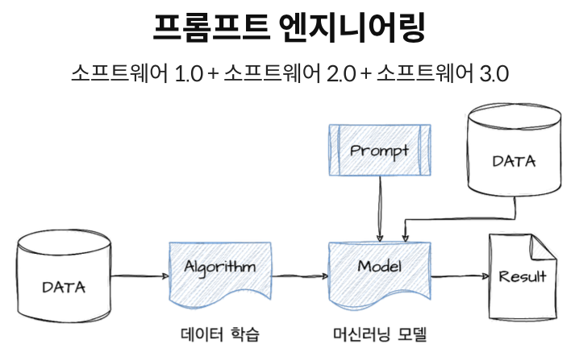  
<hr>

# _학습 목표_
- 1.LLM에 대한 기본적인 이해  
- 2.LLM을 활용하여 내가 원하는 결과를 얻기 위한 프롬프트 엔지니어링 학습/내재화  
- 3.보안에 민감한 사내 데이터를 활용하여 LLM 서비스 만들기  
- 4.다양한 LLM기반 서비스 만들고 평가 후 배포하기  
<hr>  

## [_1. Software의 구성 및 앞으로의 변화_](./Docs/Part1.%20소프트웨어%203.0/Part1._소프트웨어3.0.pdf)  
### &emsp;1). Software 구성요소  
- Software는 Data와 Data를 조작하는 알고리즘으로 구성되어 있다.  
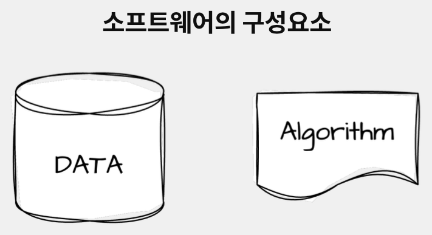

### &emsp;2). Software 1.0 / 2.0 / 3.0  
- Software 1.0은 결정론 적으로 인간이 작성한 알고리즘이 데이터를 조작하고 결과를 내는 방식임.
- Software 2.0은 데이터 기반으로 머신러닝 모델을 설계 / 개발하여 결과를 내는 방식임.
- Software 3.0은 프롬프트 엔지니어링을 통해 머신러닝 모델에게 지시를 내려 우리가 원하는 결과물을 얻는 방식임.


### &emsp;3). Software Version별 Coverage
- Software 3.0은 더 넓고 복잡한 영역을 다룰 수 있고 <span style='color:red;background-color:#dcffe4;'>**_결정론적(Code)와 통계적(ML) 프로그램_**</span> 양쪽을 모두 개발 속도를 빠르게 함.  

<hr>  

## _2. AI의 역사, LLM 현황 및 핵심개념 이해_  
### &emsp;[1). Machine Learning Concept](./Docs/Part2.%20AI의역사,%20LLM%20현황및핵심개념이해/Part2._1.Machine_Learning_Concept.pdf)
   #### &emsp;&emsp;(1).Rule-Based AI vs Machine Learning
     
   
   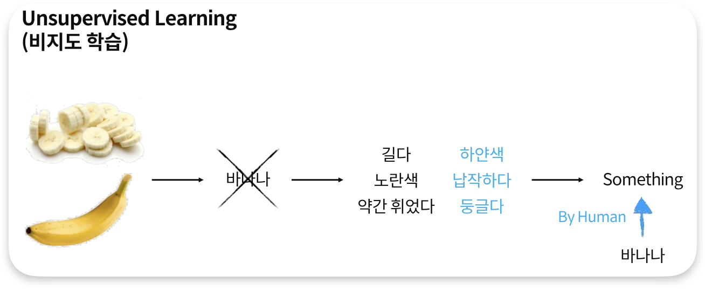  

   #### &emsp;&emsp;(2).Deep Learning
   
   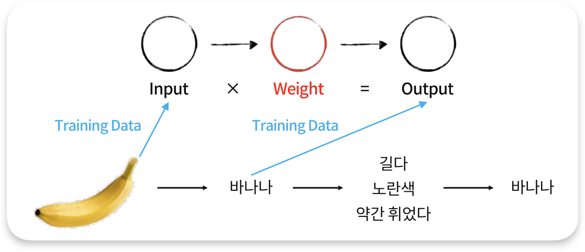
   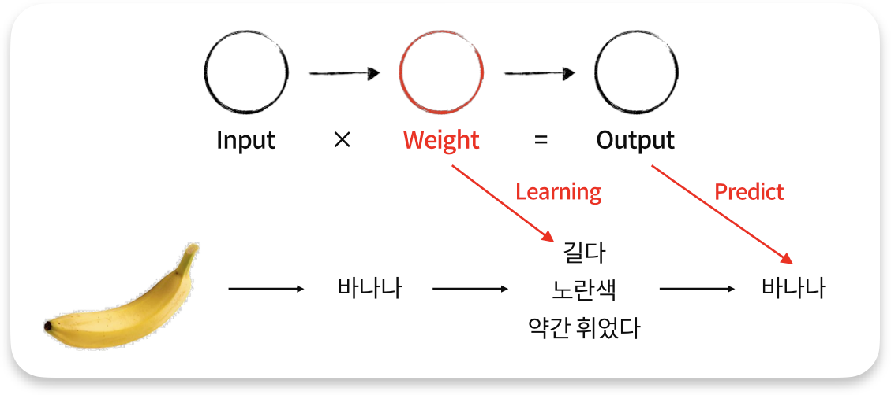

   #### &emsp;&emsp;(3). Machine Learning vs Deep Learning  
   
   

   #### &emsp;&emsp;(4). 인간의 뉴런
     

### &emsp;[2). AI History](./Docs/Part2.%20AI의역사,%20LLM%20현황및핵심개념이해/Part2._2.A%20Brief%20History%20of%20AI.pdf)  
<hr>  


## _3. Prompt Engineering 개요_  
### &emsp;1). Prompt Engineering이란?  
  
- DALL-E에서는 원하는 그림을 얻기 위해서는 Frame / Subject / Style 형태로 프롬프트를 작성해야 한다.  
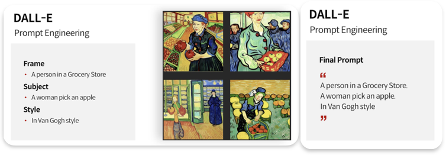
<!---


{: width="30%" height="30%"}{: .align-center}
--->
- LLM Prompt Engineering  
  1) 답변을 위해 필요한 Context를 제공해야 한다.   
  2) 원화는 결과를 추출하기 위한 프롬프트를 작성한다.
  3) 원하는 포맷의 출력을 위한 프롬프트를 작성한다.  
  
### &emsp;2). LLM Prompt Engineering  
   + **Zero-Shot**  
   예제없이 LLM에게 명령을 하는 형태를 말함.  
   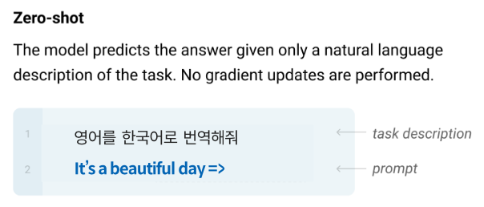  
   + **One-Shot Learning**  
     
   + **Few-shot Learning**   
      
   + **Chain of Thought (CoT)**  
   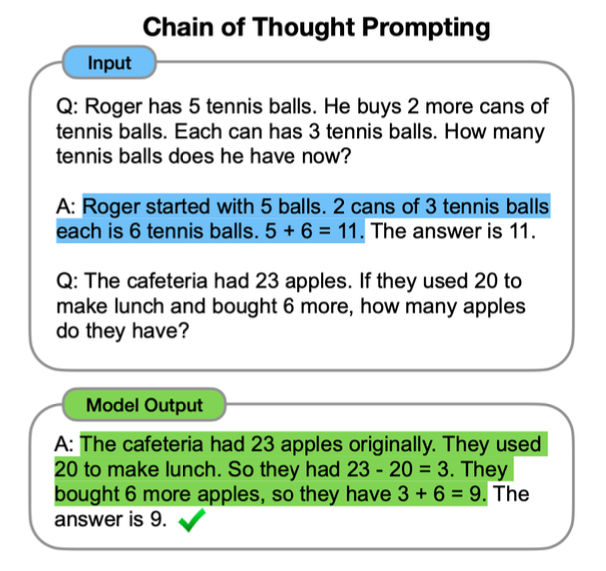  
   + **Zero Shot Chain of Thought**  
   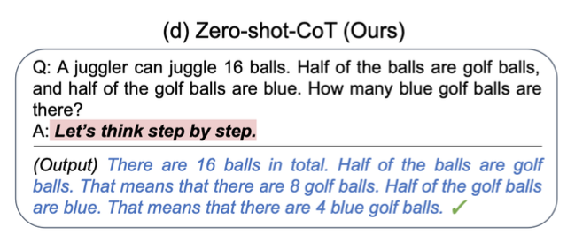
   + **Self Consistency**  
   + **Meta_Reasoning over Multiple Chains**  
   + **기타....**  
   + **Etcs**  
   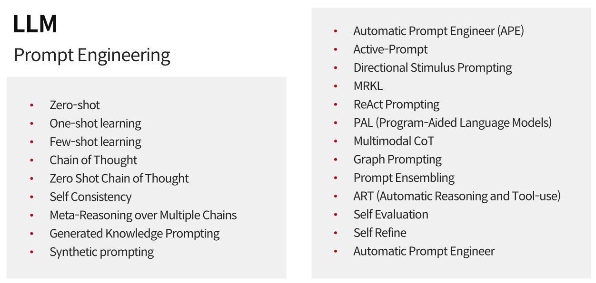


### &emsp;3). Prompt Engineering One Point Lesson
  - Prompt를 가지고 LLM에게 지시를 해서 새로운 정보를 생성해 내는 것은 잠꼬대와 같이 희미한 기억에서 말을 꺼내 오는 것과 같다.
  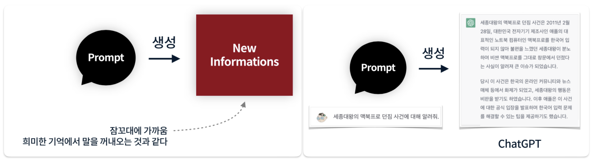
  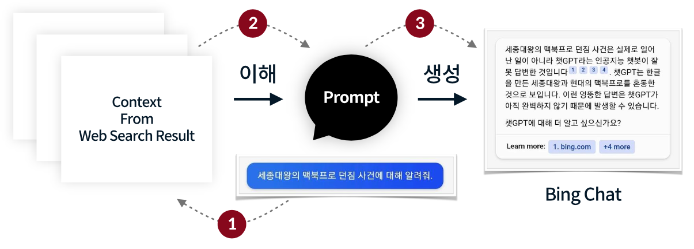   
  - **_모든 사용자는 생성에 포커싱 하지만 제대로된 정보를 생성하려면 Context를 사전에 이해하고 프롬프트를 활용해서 생성해야 한다._**   
  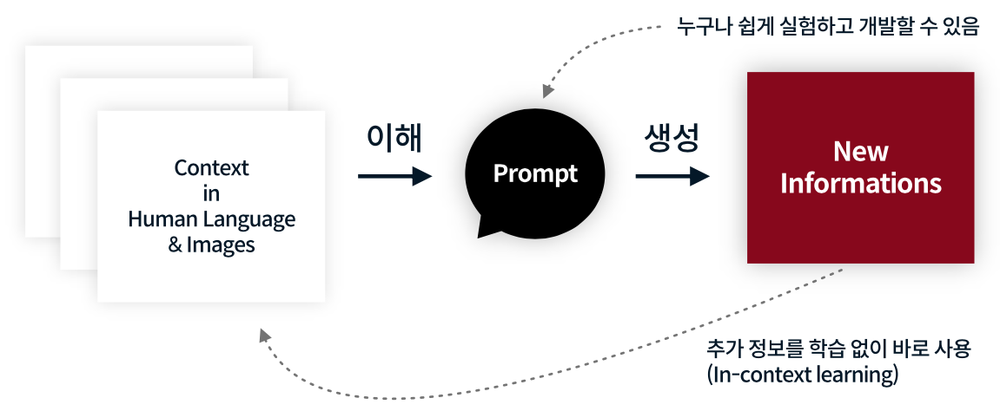   
  - ICL (In-Context Learning)   
  ICL은 LLM이 환각상태에서 말하는게 아니라 정확한 상황을 파악하고 답변할 수 있는 문맥을 제공한다.   
  문맥은 사용자가 기존에 가지고 있던 정보나, LLM의 답변을 피드백으로 제공하거나 실시간 검색을 통해 최신 정보를 제공할 수 있다.   
  Vector Search / Semantic Search 활용한다.  
  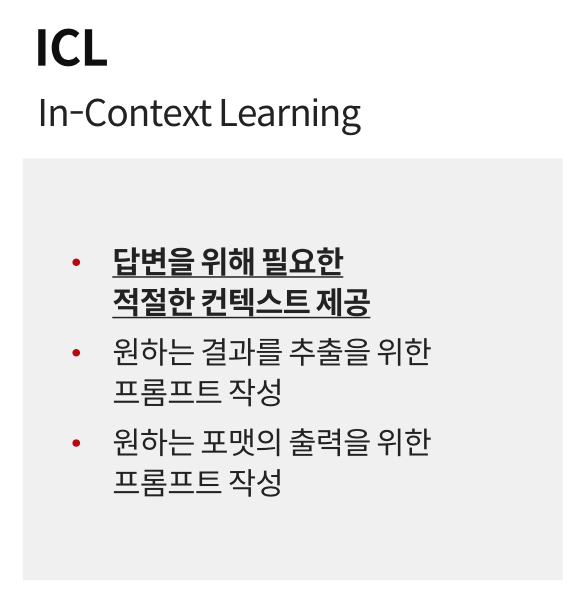    
  - 프롬프트는 Software 3.0 시대에서 프로그램(앱)을 만드는 수단이다. 즉 초 개인화된 프로그램(앱)을 개발하는 것이다.   
  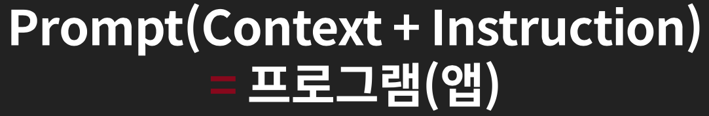   

### &emsp;4). 검색엔진의 진화 Vector Search (LLM의 숨은 영웅 Embedding)
  - Embedding (단어 / 문장 임베딩 가능))
   
  - 단어 / 문장을 Embeding Vector로 표시하고 다차원의 좌표에 매핑함. Vector간의 거리와 유사도를 비교한다.  
   
  -Vector Search / Semantic Search 개념
)
- Semantic Search를 하게 되면 
  + No More Full Text Indexing
  + No More 형태소 분석
  + No more 유사어 / 다국어 처리
  + No More 분산 시스팀...   
- Semantic Search Performance   

- 속도 극봉 방안 (Hybrid Search)   
  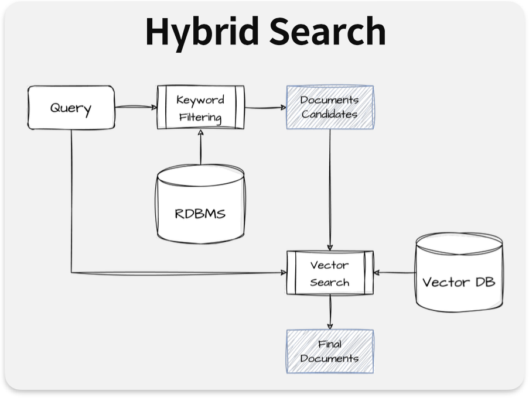   


<hr>
** 왜 안되지 **


# Dillinger
## _The Last Markdown Editor, Ever_

[](https://nodesource.com/products/nsolid)

[](https://travis-ci.org/joemccann/dillinger)

Dillinger is a cloud-enabled, mobile-ready, offline-storage compatible,
AngularJS-powered HTML5 Markdown editor.

- Type some Markdown on the left
- See HTML in the right
- ✨Magic ✨
## 😍
## Features

- Import a HTML file and watch it magically convert to Markdown
- Drag and drop images (requires your Dropbox account be linked)
- Import and save files from GitHub, Dropbox, Google Drive and One Drive
- Drag and drop markdown and HTML files into Dillinger
- Export documents as Markdown, HTML and PDF

Markdown is a lightweight markup language based on the formatting conventions
that people naturally use in email.
As [John Gruber] writes on the [Markdown site][df1]

> The overriding design goal for Markdown's
> formatting syntax is to make it as readable
> as possible. The idea is that a
> Markdown-formatted document should be
> publishable as-is, as plain text, without
> looking like it's been marked up with tags
> or formatting instructions.

This text you see here is *actually- written in Markdown! To get a feel
for Markdown's syntax, type some text into the left window and
watch the results in the right.

## Tech

Dillinger uses a number of open source projects to work properly:

- [AngularJS] - HTML enhanced for web apps!
- [Ace Editor] - awesome web-based text editor
- [markdown-it] - Markdown parser done right. Fast and easy to extend.
- [Twitter Bootstrap] - great UI boilerplate for modern web apps
- [node.js] - evented I/O for the backend
- [Express] - fast node.js network app framework [@tjholowaychuk]
- [Gulp] - the streaming build system
- [Breakdance](https://breakdance.github.io/breakdance/) - HTML
to Markdown converter
- [jQuery] - duh

And of course Dillinger itself is open source with a [public repository][dill]
 on GitHub.

## Installation

Dillinger requires [Node.js](https://nodejs.org/) v10+ to run.

Install the dependencies and devDependencies and start the server.

```sh
cd dillinger
npm i
node app
```

For production environments...

```sh
npm install --production
NODE_ENV=production node app
```

## Plugins

Dillinger is currently extended with the following plugins.
Instructions on how to use them in your own application are linked below.

| Plugin | README |
| ------ | ------ |
| Dropbox | [plugins/dropbox/README.md][PlDb] |
| GitHub | [plugins/github/README.md][PlGh] |
| Google Drive | [plugins/googledrive/README.md][PlGd] |
| OneDrive | [plugins/onedrive/README.md][PlOd] |
| Medium | [plugins/medium/README.md][PlMe] |
| Google Analytics | [plugins/googleanalytics/README.md][PlGa] |

## Development

Want to contribute? Great!

Dillinger uses Gulp + Webpack for fast developing.
Make a change in your file and instantaneously see your updates!

Open your favorite Terminal and run these commands.

First Tab:

```sh
node app
```

Second Tab:

```sh
gulp watch
```

(optional) Third:

```sh
karma test
```

#### Building for source

For production release:

```sh
gulp build --prod
```

Generating pre-built zip archives for distribution:

```sh
gulp build dist --prod
```

## Docker

Dillinger is very easy to install and deploy in a Docker container.

By default, the Docker will expose port 8080, so change this within the
Dockerfile if necessary. When ready, simply use the Dockerfile to
build the image.

```sh
cd dillinger
docker build -t <youruser>/dillinger:${package.json.version} .
```

This will create the dillinger image and pull in the necessary dependencies.
Be sure to swap out `${package.json.version}` with the actual
version of Dillinger.

Once done, run the Docker image and map the port to whatever you wish on
your host. In this example, we simply map port 8000 of the host to
port 8080 of the Docker (or whatever port was exposed in the Dockerfile):

```sh
docker run -d -p 8000:8080 --restart=always --cap-add=SYS_ADMIN --name=dillinger <youruser>/dillinger:${package.json.version}
```

> Note: `--capt-add=SYS-ADMIN` is required for PDF rendering.

Verify the deployment by navigating to your server address in
your preferred browser.

```sh
127.0.0.1:8000
```
## UML diagrams

You can render UML diagrams using [Mermaid](https://mermaidjs.github.io/). For example, this will produce a sequence diagram:

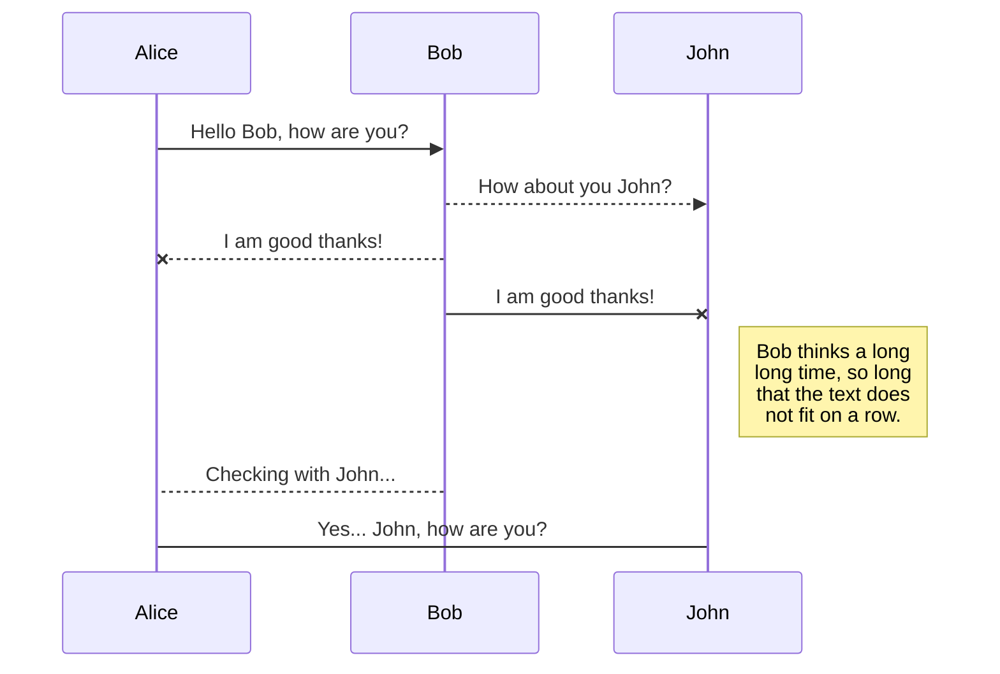

And this will produce a flow chart:

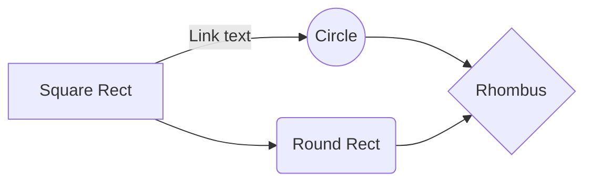
## License

MIT

**Free Software, Hell Yeah!**

[//]: # (These are reference links used in the body of this note and get stripped out when the markdown processor does its job. There is no need to format nicely because it shouldn't be seen. Thanks SO - http://stackoverflow.com/questions/4823468/store-comments-in-markdown-syntax)

   [dill]: <https://github.com/joemccann/dillinger>
   [git-repo-url]: <https://github.com/joemccann/dillinger.git>
   [john gruber]: <http://daringfireball.net>
   [df1]: <http://daringfireball.net/projects/markdown/>
   [markdown-it]: <https://github.com/markdown-it/markdown-it>
   [Ace Editor]: <http://ace.ajax.org>
   [node.js]: <http://nodejs.org>
   [Twitter Bootstrap]: <http://twitter.github.com/bootstrap/>
   [jQuery]: <http://jquery.com>
   [@tjholowaychuk]: <http://twitter.com/tjholowaychuk>
   [express]: <http://expressjs.com>
   [AngularJS]: <http://angularjs.org>
   [Gulp]: <http://gulpjs.com>

   [PlDb]: <https://github.com/joemccann/dillinger/tree/master/plugins/dropbox/README.md>
   [PlGh]: <https://github.com/joemccann/dillinger/tree/master/plugins/github/README.md>
   [PlGd]: <https://github.com/joemccann/dillinger/tree/master/plugins/googledrive/README.md>
   [PlOd]: <https://github.com/joemccann/dillinger/tree/master/plugins/onedrive/README.md>
   [PlMe]: <https://github.com/joemccann/dillinger/tree/master/plugins/medium/README.md>
   [PlGa]: <https://github.com/RahulHP/dillinger/blob/master/plugins/googleanalytics/README.md>


   [SOftwareW3.0]: <./Docs/Part1.%20소프트웨어%203.0/Part1._소프트웨어3.0.pdf>  

<hr>  

### Part1. Software 3.0
   [P1_SOftwareW3.0](./Docs/Part1.%20소프트웨어%203.0/Part1._소프트웨어3.0.pdf)  
   
### Part2. AI역사 및 LLM 현황 및 핵심 개념 이해
   [P2.1_ML_Concept](./Docs/Part2.%20AI의역사,%20LLM%20현황및핵심개념이해/Part2._1.Machine_Learning_Concept.pdf)  
   [P2.2_AI_History](./Docs/Part2.%20AI의역사,%20LLM%20현황및핵심개념이해/Part2._2.A%20Brief%20History%20of%20AI.pdf)  
   [P2.3_LLM](./Docs/Part2.%20AI의역사,%20LLM%20현황및핵심개념이해/Part2._3-1.%20LLM_완전히새로운시대의개막.pdf)  
   [P2.4_HowPossible](./Docs/Part2.%20AI의역사,%20LLM%20현황및핵심개념이해/Part2._3-2.%20어떻게가능해졌나.pdf)
   [P2.5_WhyImportant](./Docs/Part2.%20AI의역사,%20LLM%20현황및핵심개념이해/Part2._3-3.이것이왜그렇게중요한가.pdf)  
   [P2.6_FineTuning_vs_PromptEngineering](./Docs/Part2.%20AI의역사,%20LLM%20현황및핵심개념이해/Part2._4.%20파인튜닝vs프롬프트엔지니어링.pdf)  
   [P2.7_새로운기회찾기](./Docs/Part2.%20AI의역사,%20LLM%20현황및핵심개념이해/Part2._5.새로운기회찾기.pdf)  
   
### Part3. 프롬프트 엔지니어랑 개요
   [P3.1_PromptEngineering1](./Docs/Part3.%20프롬프트엔지니어링_개요/Part3._1.프롬프트엔지니어링이란.pdf)
   [P3.2_PromptEngineering2](./Docs/Part3.%20프롬프트엔지니어링_개요/Part3._2.프롬프트엔지니어링%20-%20One%20Point%20Lesson.pdf)   
   [P3.3_VectorSearch](./Docs/Part3.%20프롬프트엔지니어링_개요/Part3._3.검색엔진의진화%20Vector%20Search.pdf)  

### Part4. 프롬프트 엔지니어랑 기초지식
   [P4.1_PromptDesignFramework](./Docs/Part4.프롬프트%20엔지니어링%20기초%20지식/디자인1차_Part4._1.프롬프트%20디자인%20프레임워크.pdf)  
   [P4.1_PromptTechnicTop7](./Docs/Part4.프롬프트%20엔지니어링%20기초%20지식/디자인1차_Part4._2.프롬프팅테크닉Top%207.pdf)  
   [P4.1_PromptExtentionTechnic](./Docs/Part4.프롬프트%20엔지니어링%20기초%20지식/디자인1차_Part4._3.프롬프팅%20확장%20테크닉.pdf)  
   [P4.1_PromptSecurity](./Docs/Part4.프롬프트%20엔지니어링%20기초%20지식/디자인1차_Part4._4.프롬프트보안.pdf)  

### Part5. 프롬프트 엔지니어랑 기초실습
   [P5.1_실습도구소개](./Docs/Part5.프롬프트%20엔지니어링%20기초%20실습/디자인1차_Part5._1.실습%20도구%20소개_3-4비율.pdf)  
   [P5.2_생성조건이해하기](./Docs/Part5.프롬프트%20엔지니어링%20기초%20실습/디자인1차_Part5._2.생성%20조건%20이해하기.pdf)  
   [P5.3_자연어처리TaskTop10](./Docs/Part5.프롬프트%20엔지니어링%20기초%20실습/디자인1차_Part5._3.자연어%20처리%20태스크%20Top10_3-4비율.pdf)  
   [P5.4_Prompt테크닉Top7실습](./Docs/Part5.프롬프트%20엔지니어링%20기초%20실습/디자인1차_Part5._4.프롬프팅%20테크닉%20Top7%20실습_3-4비율.pdf)  
   [P5.5_Acting 및 Formatting](./Docs/Part5.프롬프트%20엔지니어링%20기초%20실습/디자인1차_Part5._5.액팅_포맷팅_3-4비율.pdf)    
   [P5.6_Prompt Chaining](./Docs/Part5.프롬프트%20엔지니어링%20기초%20실습/디자인1차_Part5._5.액팅_포맷팅_3-4비율.pdf)  
   [P5.7_좋은프롬프트만들기](./Docs/Part5.프롬프트%20엔지니어링%20기초%20실습/디자인1차_Part5._7.좋은%20프롬프트%20만들기_3-4비율.pdf)    

### Part6. 프롬프트 엔지니어랑 기초실습
   [P6.1_적합한모델선택하기](./Docs/Part6.프롬프트%20엔지니어링%20응용%20심화/디자인1차_Part6._1.적합한%20모델%20선택하기.pdf)    
   [P6.2_FunctionCalling(Tooling)](./Docs/Part6.프롬프트%20엔지니어링%20응용%20심화/디자인1차_Part6._2.Function%20Calling%20(Tooling).pdf)    
   [P6.3_프롬프트평가와 테스팅](./Docs/Part6.프롬프트%20엔지니어링%20응용%20심화/디자인1차_Part6._3.프롬프트%20평가와%20테스팅.pdf)  
   [P6.4_임베딩과 시맨틱 서치](./Docs/Part6.프롬프트%20엔지니어링%20응용%20심화/디자인1차_Part6._4.임베팅과%20시멘틱%20서치.pdf)  

### Part7. 프롬프트 엔지니어랑 실무
   [P7.1_간단히응용하기]()  
   [P7.2_조금복잡한응용하기]()  
   [P7.3_환각줄이기]()  
   [P7.4_스트리밍응답처리]()  
   [P7.5_데이터보완]()  
   [P7.6_ChatGPT에 프롬프트작성 도움받기]()  

### Part8. LLM Application개발
   [P8.1_]()  
   [P8.1_]()  
   [P8.1_]()  
<hr>  


<details open>
   <summary>열린상태에서 시작</summary>
<pre>
내용1
내용2
내용3
</pre>
</details>

<details>
   <summary>더보기</summary>
<pre>
내용1
내용2
내용3
</pre>
</details>
